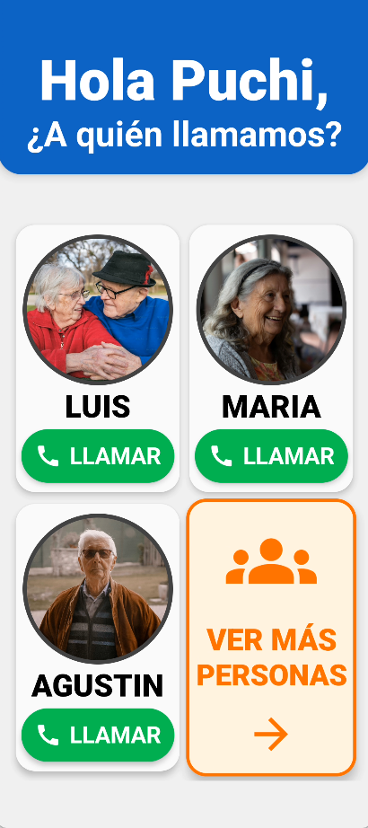
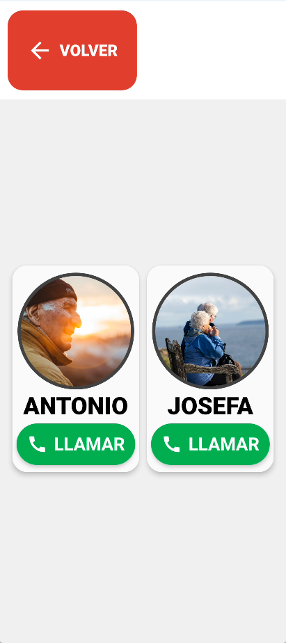
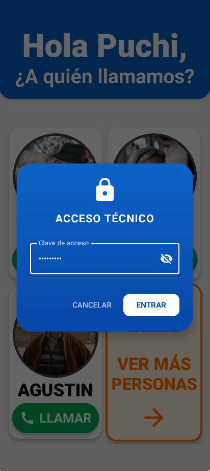
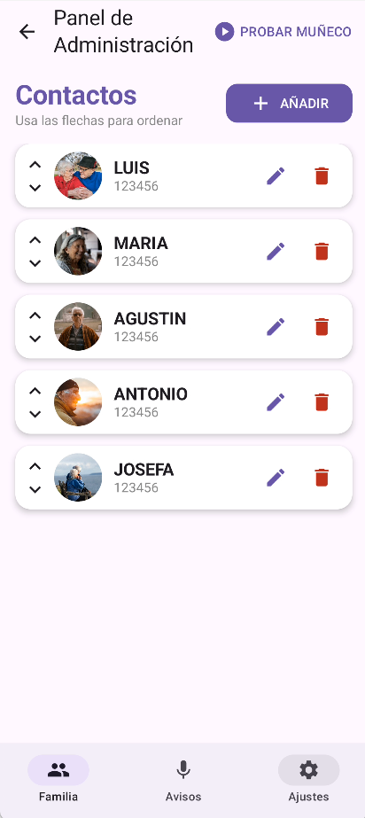
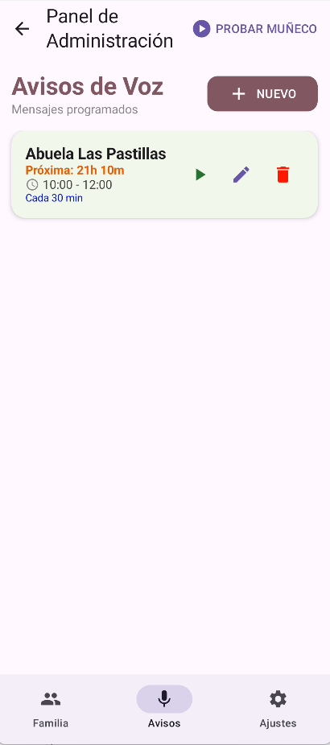
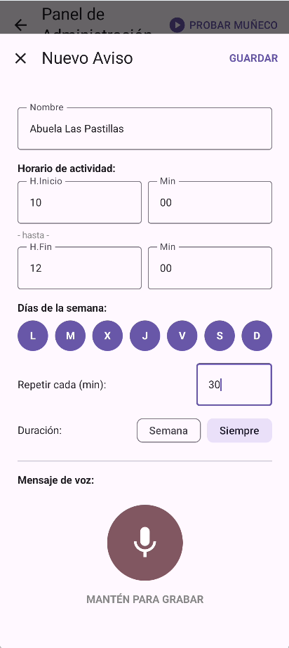
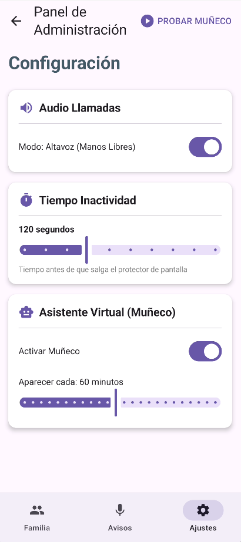

<table>
  <tr>
    <td>
      
    </td>
    <td>
      <h1>Recordatorios de Puchi</h1>
      

        
         
        <b>Una solución digital para la tercera edad.</b>
      

    </td>
  </tr>
</table>

---

## 🇪🇸 Español

### 📖 Contexto del Proyecto: La Realidad de Puchi
El centro de este proyecto es **Puchi**, mi abuela de **85 años**.
Puchi lleva **muchos años diagnosticada de Alzheimer**. Su vida se basa estrictamente en la **rutina**; su cerebro funciona como un reloj de costumbres.

Sin embargo, **si algo se sale de su guion diario, para ella no existe.** Hemos comprobado que la única forma de que Puchi retenga una información nueva es mediante la **repetición constante ("machaque")**: hay que recordarle el evento cada poco tiempo para que se fije en su memoria a corto plazo.

### 🧩 El Problema: Presencia vs. Autonomía
La familia no puede estar físicamente a su lado cada 2 horas para repetirle: *"Abuela, hoy viene el médico"*. Aquí es donde entra la aplicación como una **prótesis de memoria**.

La app se ha diseñado para cubrir ese hueco, basándose en dos pilares:
1.  **Accesibilidad Física (Acelerómetro):** Gracias al sensor de movimiento, **al levantar el teléfono, este se despierta y está listo**.
2.  **El Dilema del "Siempre Encendido":**
    * *El problema:* Mantener una imagen fija quemaría la pantalla OLED.
    * *La solución:* Un **Asistente Virtual** que actúa como salvapantallas dinámico, protegiendo el hardware y recordando a Puchi verbalmente qué es ese aparato.

---

### ⚡ Ingeniería de Hardware y Gestión Energética
Para este proyecto hemos reutilizado un **OnePlus 8T**, un dispositivo potente pero que requería una adaptación profunda para funcionar como "estación kiosco" conectada 24/7 sin degradar su vida útil.

Un dispositivo móvil no está diseñado para estar siempre cargando. Para evitar el hinchazón de la batería y el sobrecalentamiento, implementamos una estrategia de **"Carga Fría y Estacionaria"**:

1.  **Smart Charging Logic (Root/Kernel):**
    * Hemos limitado la carga por software para que **nunca supere el 60%** y se reactive solo al bajar del **50-55%**.
    * Esto mantiene la batería en su rango de voltaje óptimo (histéresis), evitando el estrés químico de estar al 100% constantemente.
    * Se fuerza una **carga lenta y fría**, limitando el amperaje de entrada para mantener la temperatura del chasis baja, segura para las manos de Puchi.

2.  **Optimización del Display:**
    * A pesar de que el OnePlus 8T soporta 120Hz, hemos **reducido la tasa de refresco a 60Hz** a nivel de sistema.
    * Esto reduce drásticamente el consumo de GPU y la temperatura general del dispositivo, prolongando la vida útil de los componentes internos.

3.  **Adaptación Física (Base Magnética):**
    * Puchi ha perdido la motricidad fina para conectar cables USB-C.
    * Solución: **Base de Carga con conector Magnético**. Convierte la carga en un gesto simple de "dejar caer" el teléfono, eliminando la fricción y la frustración, ya que el dispositivo usado no dispone de carga inalámbrica.

---

### ✨ Funcionalidades Clave

#### 1. 🤖 El Asistente Virtual
* **Recordatorio de Propósito:** El asistente "despierta" y le recuerda verbalmente: *"Hola, soy tu teléfono, estoy aquí para que llames a tus hijos"*. Sin este estímulo, ella olvida la función del objeto.
* **Compañía:** Un avatar animado con sincronización labial, que le genera estímulos fomentando la capacidad de recordarlo.

  <h3>🎥 <a href="assets/AsistenteSalvapantallas.mp4">VER VIDEO DEL ASISTENTE EN FUNCIONAMIENTO</a> 🎥</h3>
  
<i>(Haz clic en el enlace para reproducir el video MP4)</i>

#### 2. 🛡️ Seguridad Telefónica (Role Manager)
* **Lista Blanca Estricta:** La app toma el control de la telefonía. Solo entran llamadas de números guardados.
* **Bloqueo Silencioso:** Cualquier número desconocido es rechazado automáticamente en segundo plano. El teléfono ni siquiera suena evitando posibles estafas.

#### 3. 👁️ Interfaz Hiper-Accesible (Modo Kiosco)
* **Botones Gigantes y Fotos Reales:** Eliminamos la abstracción de leer nombres. Puchi ve la cara de su hijo y pulsa.
* **Navegación Lineal:** Sin menús anidados. Todo está a un toque de distancia.

| Menú Principal | Navegación Lineal |
|:---:|:---:|
|  |  |

#### ⚙️ Panel de Administración (Para la Familia)

| Seguridad | Gestión de Contactos |
|:---:|:---:|
|  |  |

| Gestión de Avisos | Crear Recordatorio | Ajustes de Hardware |
|:---:|:---:|:---:|
|  |  |  |

---

### 🔧 Stack Tecnológico y Herramientas
* **Dispositivo:** OnePlus 8T (Reutilizado & Optimizado).
* **Entorno de Desarrollo:** Android Studio Ladybug.
* **Lenguaje:** Kotlin.
* **UI:** Jetpack Compose.
* **Base de Datos:** Room (SQLite).
* **Gestión de Energía:** Limitador de carga (60%), Underclocking de pantalla (60Hz), AlarmManager Exact.
* **Hardware Adicional:** Adaptador magnético USB-C + Base de carga.

---

### 📄 Licencia
Este proyecto se distribuye bajo la licencia **Creative Commons Atribución-NoComercial 4.0 Internacional (CC BY-NC 4.0)**.
* **Atribución:** Debes citar al autor original.
* **No Comercial:** Prohibido lucrarse con este software de ayuda social.

---
---

## 🇺🇸 English

### 📖 Project Context: Puchi's Reality
At the core of this project is **Puchi**, my **85-year-old** grandmother, diagnosed with **Alzheimer's disease** many years ago.
Her life is strictly based on **routine**. If an event falls outside her daily script, **it simply does not exist for her.** We have learned that the only way for Puchi to retain information is through **constant repetition**: the event must be mentioned repeatedly to stick in her short-term memory.

### 🧩 The Problem: Presence vs. Autonomy
The family cannot be physically present every 2 hours to repeat reminders. This app serves as a **memory prosthesis**, designed on two pillars:
1.  **Physical Accessibility:** Thanks to the accelerometer, simply **picking up the phone wakes it up**.
2.  **The "Always-On" Dilemma:** A static image would burn the OLED screen. We created a **Virtual Assistant** that acts as a dynamic screensaver, protecting the hardware while verbally reminding Puchi of the device's purpose.

---

### ⚡ Hardware Engineering & Power Management
We repurposed a **OnePlus 8T** for this project, a powerful device that required deep adaptation to function as a 24/7 connected "kiosk station" without degrading its lifespan.

A mobile device is not designed to be constantly charging. To prevent battery swelling and overheating, we implemented a **"Cold & Stationary Charging"** strategy:

1.  **Smart Charging Logic (Root/Kernel):**
    * We limited charging via software to **cap at 60%** and only resume when dropping below **50-55%**.
    * This keeps the battery in its optimal voltage range (hysteresis), avoiding the chemical stress of sitting at 100%.
    * We forced a **slow and cold charge**, throttling input amperage to keep the chassis temperature low and safe for Puchi's hands.

2.  **Display Optimization:**
    * Even though the OnePlus 8T supports 120Hz, we **underclocked the refresh rate to 60Hz** at the system level.
    * This drastically reduces GPU consumption and overall device temperature, extending component longevity.

3.  **Physical Adaptation (Magnetic Dock):**
    * Puchi lacks the fine motor skills to plug in USB-C cables.
    * Solution: **Magnetic Connector Dock**. This turns charging into a simple "drop and charge" action, removing friction and frustration.

---

### ✨ Key Features

#### 1. 🤖 The Virtual Assistant: An "Anchor to Reality"
* **Purpose Reminder:** The assistant verbally reminds her: *"Hello, I am your phone, I am here for you to call your children."*
* **Companionship:** An animated avatar with lipsync reduces the feeling of interacting with a cold machine.

  <h3>🎥 <a href="assets/AsistenteSalvapantallas.mp4">WATCH ASSISTANT DEMO VIDEO</a> 🎥</h3>
  
<i>(Click link to play MP4 video)</i>

#### 2. 🛡️ Phone Security (Role Manager)
* **Strict Whitelist:** The app controls telephony. Only calls from saved numbers are allowed.
* **Silent Blocking:** Unknown numbers are automatically rejected in the background to prevent scams and anxiety.

#### 3. 👁️ Hyper-Accessible Interface (Kiosk Mode)
* **Giant Buttons & Real Photos:** No reading required. Puchi sees a face and taps.
* **Linear Navigation:** No nested menus.

| Main Menu | Linear Navigation |
|:---:|:---:|
|  |  |

#### ⚙️ Admin Panel (Family Control)

| Security | Contact Management |
|:---:|:---:|
|  |  |

| Reminders | Create Reminder | Hardware Settings |
|:---:|:---:|:---:|
|  |  |  |

---

### 🔧 Tech Stack & Tools
* **Device:** OnePlus 8T (Repurposed & Optimized).
* **IDE:** Android Studio Ladybug.
* **Language:** Kotlin.
* **UI:** Jetpack Compose.
* **Database:** Room (SQLite).
* **Power Management:** Charge Limiter (60%), Screen Underclocking (60Hz), Exact AlarmManager.
* **Hardware Add-on:** Magnetic USB-C Adapter + Dock.

---

### 📄 License
Licensed under **Creative Commons Attribution-NonCommercial 4.0 International (CC BY-NC 4.0)**.
* **Attribution:** You must credit the author.
* **Non-Commercial:** Profiting from this social aid software is prohibited.

Copyright (c) 2026 [Aarón Benítez]
